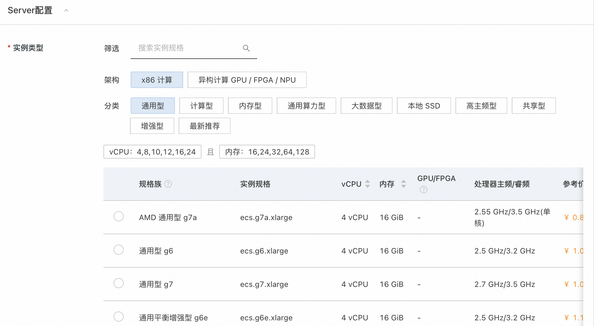
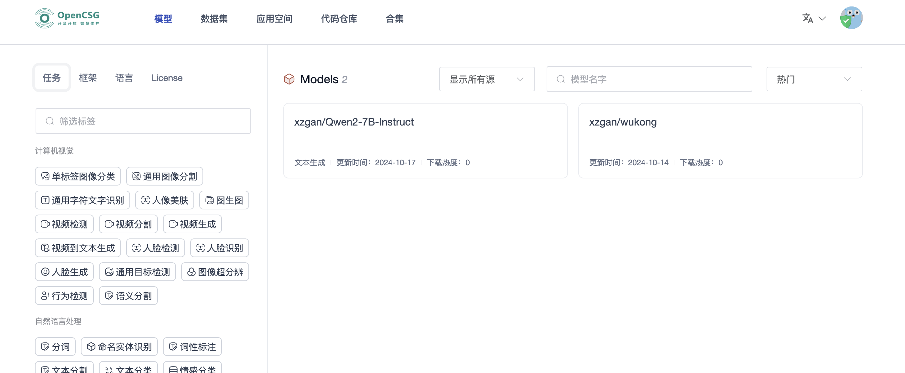
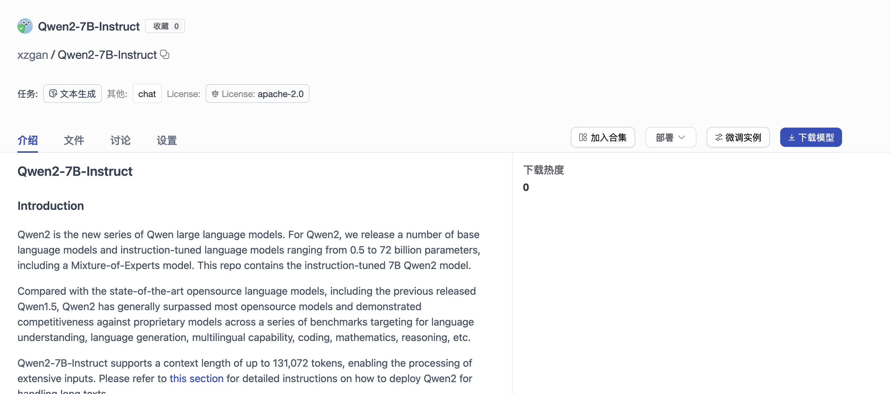
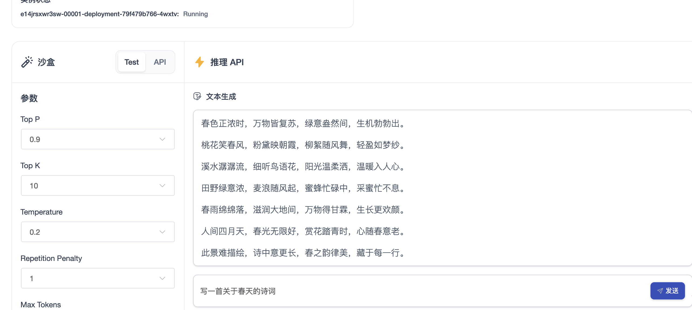

# CSGHub服务实例部署文档

## 概述

CSGHub 基座是一个大模型和数据集管理平台，为大模型应用研发团队提供全生命周期的模型、数据集、代码等资产管理能力。
✓ 帮助用户治理LLM和LLM应用生命周期中涉及到的资产(数据集、模型文件、代码等)。
✓ 用户可以通过Web界面、Git命令行或者自然语言Chatbot等方式，实现对模型文件、数据集、代码等资产的操作，包括上传、下载、存储、校验和分发。
✓ 平台提供微服务子模块和标准化API，便于用户与自有系统集成。
✓ 一键推理与微调的能力。
✓ 模型自动同步能力。

## 计费说明

CSGHub在计算巢上的费用主要涉及：

- 所选vCPU与内存规格
- 系统盘类型及容量
- 公网带宽

计费方式包括：

- 按量付费（小时）
- 包年包月

## 部署架构

一个CSGHub Server + K8S cluster

## RAM账号所需权限

CSGHub服务需要对ECS、VPC等资源进行访问和创建操作，若您使用RAM用户创建服务实例，需要在创建服务实例前，对使用的RAM用户的账号添加相应资源的权限。添加RAM权限的详细操作，请参见[为RAM用户授权](https://help.aliyun.com/document_detail/121945.html)。所需权限如下表所示。

| 权限策略名称 | 备注 |
| --- | --- |
| AliyunECSFullAccess | 管理云服务器服务（ECS）的权限 |
| AliyunBSSReadOnlyAccess | 只读访问费用中心（BSS）的权限 |
| AliyunCSFullAccess | 管理容器服务（CS）的权限 |
| AliyunVPCFullAccess | 管理专有网络（VPC）的权限 |
| AliyunROSFullAccess | 管理资源编排服务（ROS）的权限 |
| AliyunSLBFullAccess | 管理负载均衡服务（SLB）的权限 |
| AliyunComputeNestUserFullAccess | 管理计算巢服务（ComputeNest）的用户侧权限 |

## 部署流程

### 部署步骤

1. 单击部署[链接](https://computenest.console.aliyun.com/service/instance/create/cn-hangzhou?type=user&ServiceId=service-712413c5c35c47b3a42c)，进入服务实例部署界面，根据界面提示，填写参数完成部署。
2. 填写csghub Server相关参数，并填写实例密码

3. 填写Kubernetes配置相关参数以及节点规模，并填写实例密码

4. 确认并创建实例

### 使用CSGHub
1. 注册登录并上传模型

2. 选择模型并一键部署推理

3. 等待部署完成

4. 测试推理效果

